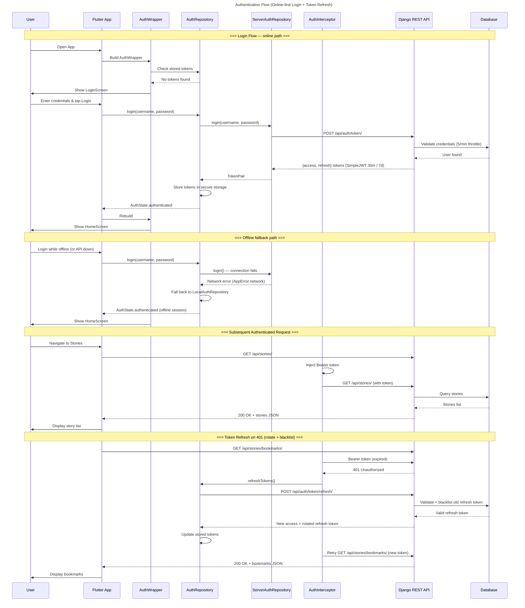
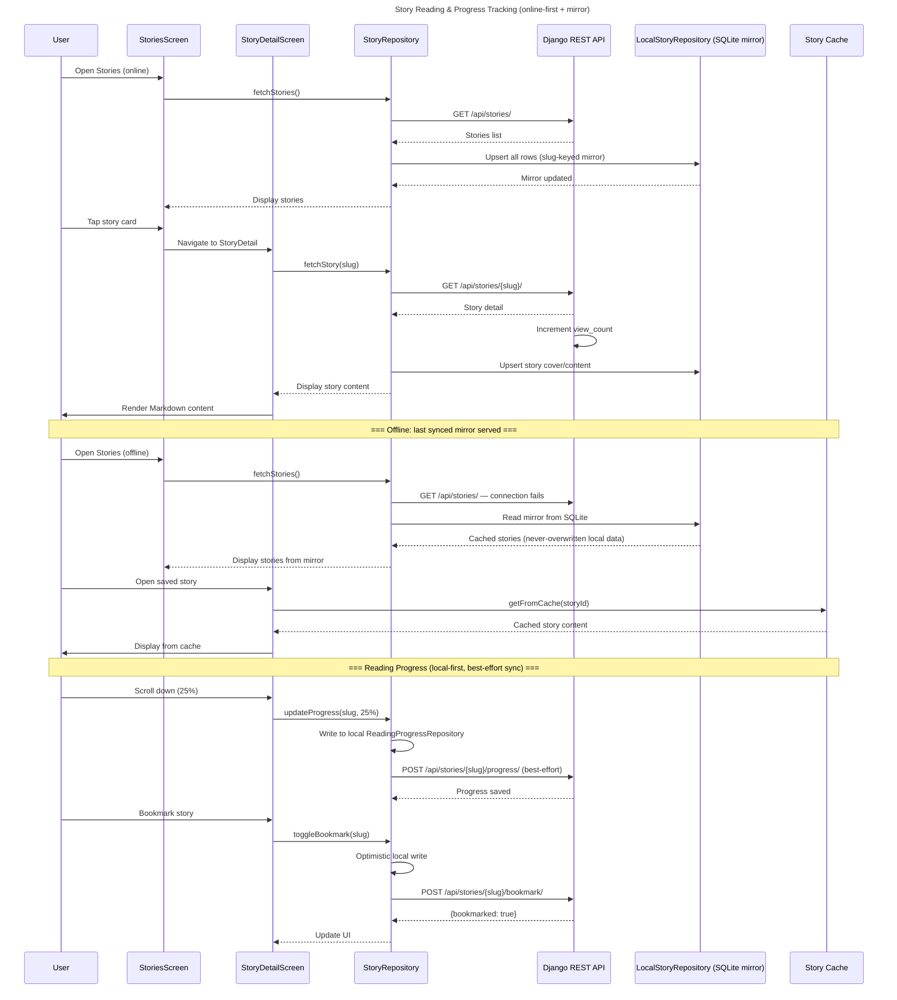
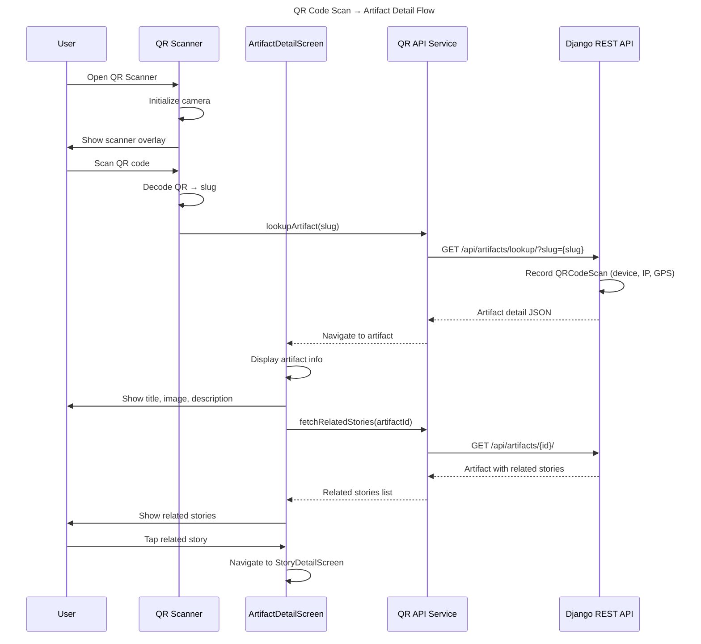
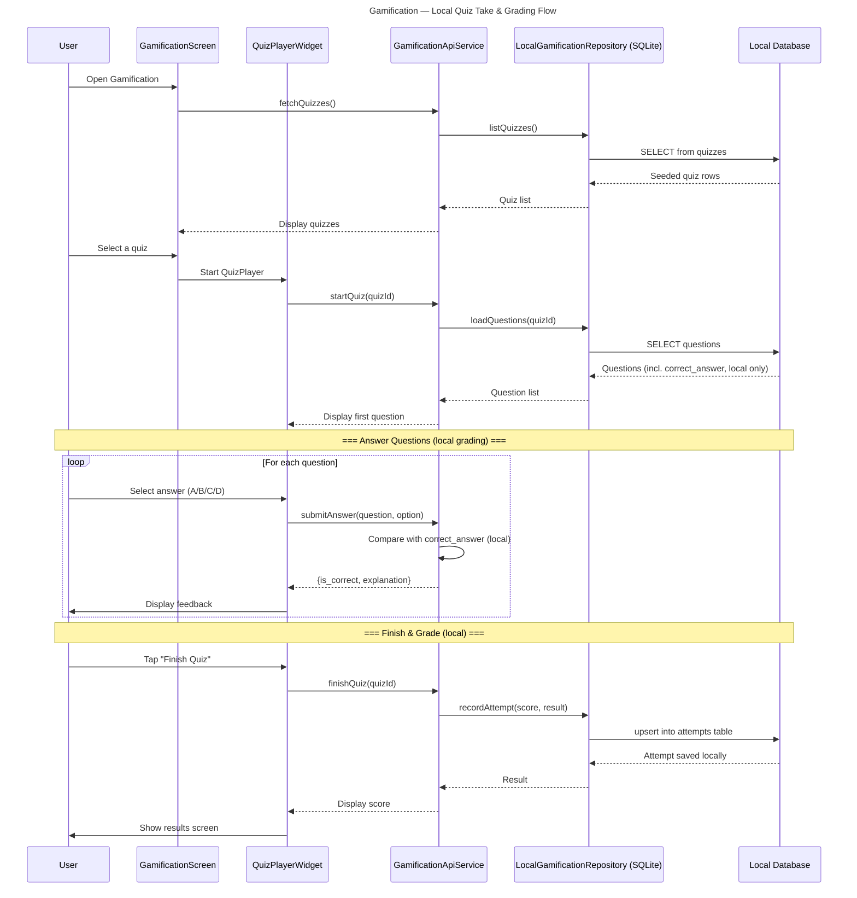
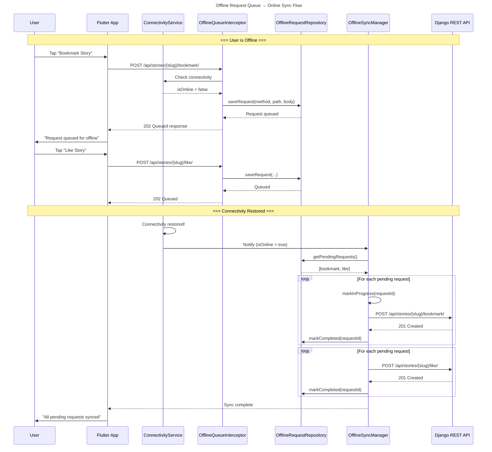
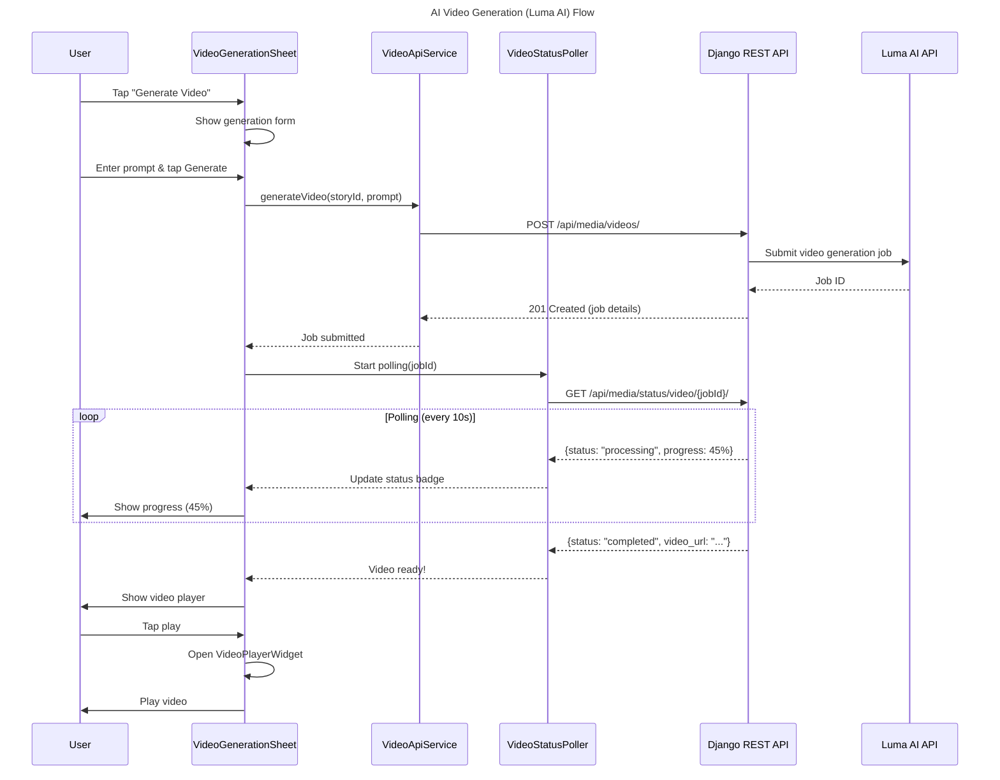

# Sequence Diagrams — Griot 2.0

> **Updated 2026-09-23:** Auth is **online-first** (`AuthRepository` →
> `ServerAuthRepository` obtains real JWT pairs from `/api/auth/token/`; the
> legacy SQLite/secure-storage session only kicks in as an offline fallback).

## 1. Authentication Flow

## 2. Story Reading + Progress Tracking

## 3. QR Code Scan → Artifact Detail

## 4. Gamification: Quiz Flow (local SQLite)

> **Updated 2026-09-23:** on mobile, quizzes are served **locally** from SQLite
> (`GamificationApiService` → `LocalGamificationRepository`). The Django
> `/api/gamification/*` endpoints exist for the web client and are **not**
> consumed by the Flutter app; `getLeaderboard()` returns `[]`.

## 5. Offline → Online Sync

## 6. AI Video Generation Flow

