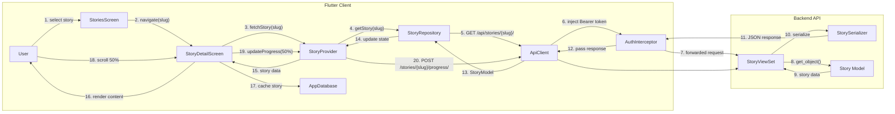
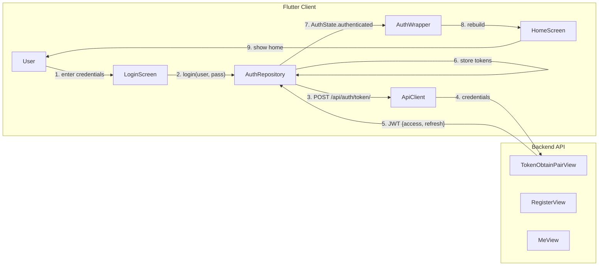
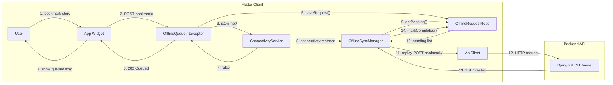
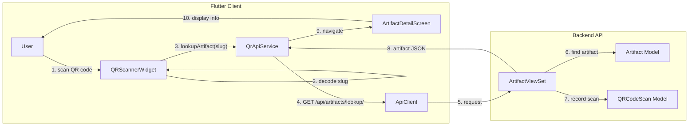

# Communication Diagram — Griot 2.0

## 1. Story Reading Communication



## 2. Authentication Communication



## 3. Offline Queue Communication



## 4. QR Scan Communication



## 5. Media Generation Communication

```mermaid
flowchart LR
    subgraph "Flutter Client"
        U["User"]
        VGS["VideoGenerationSheet"]
        VPS["VideoStatusPoller"]
        VAS["VideoApiService"]
        AC["ApiClient"]
    end

    subgraph "Backend API"
        VV["VideoViewSet"]
        VJ["VideoGenerationJob"]
    end

    subgraph "External"
        Luma["Luma AI API"]
    end

    U -- "1. enter prompt" --> VGS
    VGS -- "2. generateVideo()" --> VAS
    VAS -- "3. POST /api/media/videos/" --> AC
    AC --> VV
    VV -- "4. create job" --> VJ
    VV -- "5. call Luma AI" --> Luma
    Luma -- "6. job_id" --> VV
    VV -- "7. job created" --> VAS
    VAS -- "8. start polling" --> VPS

    loop "Poll every 10s"
        VPS -- "9. GET /status/video/{id}/" --> AC
        AC --> VV
        VV -- "10. job status" --> VPS
        VPS -- "11. update badge" --> VGS
    end

    VV -- "12. completed + video_url" --> VPS
    VPS -- "13. video ready" --> VGS
    VGS -- "14. show player" --> U
```
