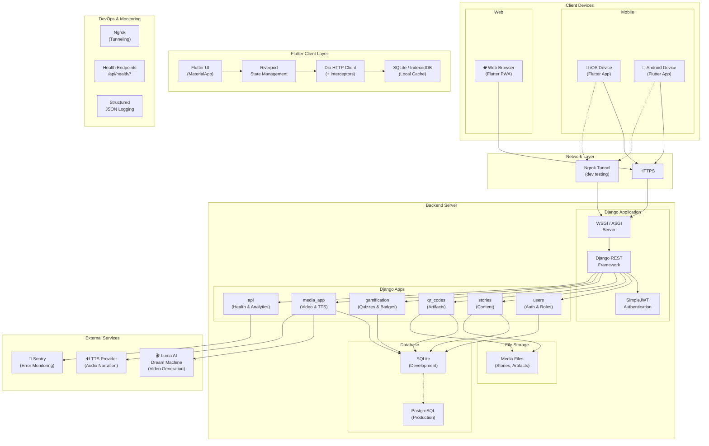
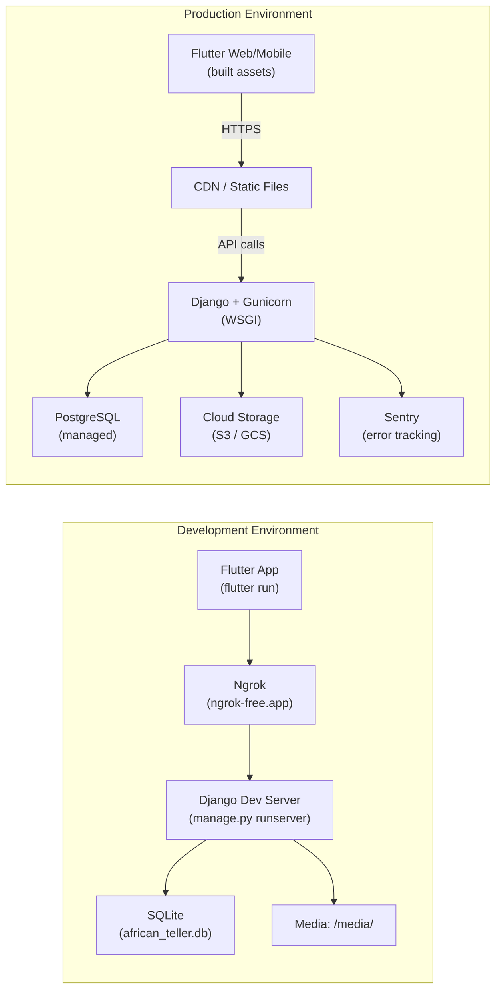

# Deployment Diagram — Griot 2.0

## System Deployment Architecture

## Development vs Production

## Deployment Details

| Component | Development | Production |
|---|---|---|
| **Frontend** | `flutter run` (hot reload) | Built APK/IPA/Web assets |
| **Backend** | `manage.py runserver` | Gunicorn + Nginx |
| **Database** | SQLite (`african_teller.db`) | PostgreSQL |
| **File Storage** | Local `media/` directory | Cloud storage (S3/GCS) |
| **Tunneling** | Ngrok (`ngrok-free.app`) | N/A (direct HTTPS) |
| **Monitoring** | Console logs | Sentry + structured JSON logs |
| **SSL/TLS** | Ngrok-provided | Let's Encrypt / Cloudflare |
| **CORS** | `CORS_ALLOW_ALL_ORIGINS = True` | Restricted origins |
| **Media Serving** | Django `static()` | Nginx / CDN |

## Environment Variables

| Variable | Development | Production |
|---|---|---|
| `DEBUG` | `True` | `False` |
| `SECRET_KEY` | `django-insecure-dev-only...` | Secure random key |
| `ALLOWED_HOSTS` | `localhost, 127.0.0.1, *.ngrok-free.app` | `africanteller.org` |
| `DATABASE_URL` | — (SQLite) | `postgres://...` |
| `SENTRY_DSN` | Optional | Required |
| `API_BASE_URL` | `http://10.0.2.2:8000` | `https://api.africanteller.org` |
| `NGROK_URL` | `https://xxxx.ngrok-free.app` | — |
