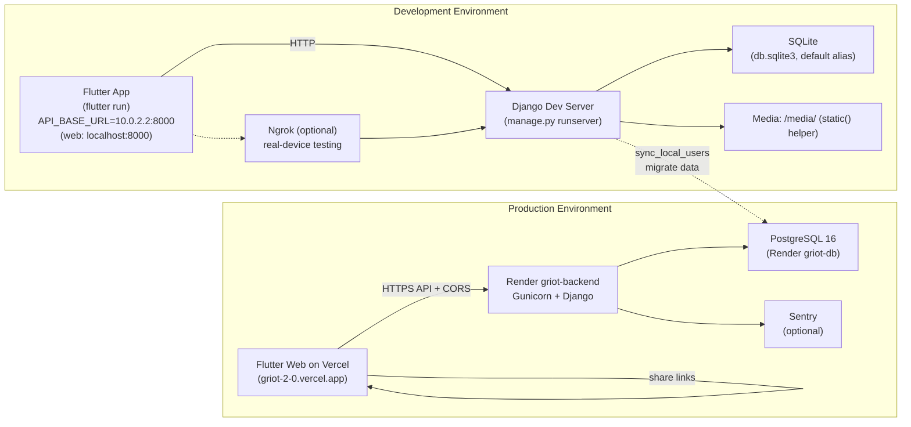
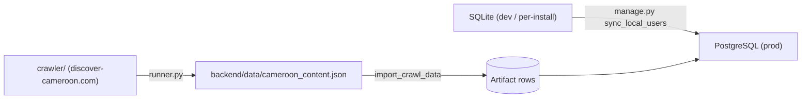

# Deployment Diagram — Griot 2.0

> **Reconciled with the implementation on 2026-09-23** from `render.yaml`,
> `backend/config/settings/{dev,prod}.py` and
> `frontend/lib/core/constants/app_constants.dart`.
> Key corrections vs. earlier drafts: no S3/GCS, no CDN, no custom SSL/Cloudflare —
> the backend runs on **Render** (Gunicorn + managed PostgreSQL 16) and the
> Flutter web client is hosted on **Vercel** (`griot-2-0.vercel.app`). Media is
> served by Django itself at `/media/`. Sentry is optional on both sides
> (DSN-gated).

## System Deployment Architecture

```mermaid
flowchart TB
    subgraph "Client Devices"
        subgraph "Mobile"
            iOS["📱 iOS Device<br/>(Flutter App)"]
            Android["📱 Android Device<br/>(Flutter App)"]
        end
        subgraph "Web"
            PWA["🌐 Browser<br/>(Flutter Web on Vercel)"]
        end
    end

    subgraph "Flutter Client Layer"
        direction LR
        UI["Flutter UI<br/>(MaterialApp + AppRouter)"]
        Riverpod["Riverpod<br/>State Management"]
        Dio["Dio HTTP Client<br/>(auth / retry / offline interceptors)"]
        SQLite["SQLite / IndexedDB<br/>(griot_ai.db, local mirror + queue)"]
    end

    subgraph "Network"
        HTTPS["HTTPS"]
        Ngrok["Ngrok Tunnel<br/>(dev-only, real-device testing)"]
    end

    subgraph "Vercel (Flutter Web)"
        Vercel["https://griot-2-0.vercel.app<br/>(static build + share links)"]
    end

    subgraph "Render.com (Backend)"
        direction TB

        subgraph "griot-backend service"
            Gunicorn["Gunicorn WSGI<br/>(migrate + start)"]
            Django["Django REST Framework<br/>+ SimpleJWT + Throttling"]
            Apps["Apps<br/>users · stories · qr_codes ·<br/>gamification · media_app · api · web"]
        end

        Postgres["PostgreSQL 16<br/>(griot-db, managed)"]
        Media["Media Files<br/>/media/ on Render disk"]
    end

    subgraph "External Services"
        direction LR
        LumaAI["🎬 Luma AI<br/>Dream Machine<br/>(video generation)"]
        TTSService["🔊 Google TTS via gTTS<br/>(no API key)"]
        Sentry["🐛 Sentry<br/>(optional, DSN-gated)"]
        WhatsApp["💬 WhatsApp<br/>(feedback wa.me link)"]
    end

    subgraph "DevOps & Monitoring"
        direction LR
        HealthCheck["Health Endpoints<br/>/api/health/ · /api/health/ready/<br/>/api/health/metrics/"]
        StructLog["Structured JSON Logging<br/>(RequestLogMiddleware +<br/>JsonFormatter)"]
        SyncCmd["sync_local_users<br/>(SQLite → Postgres)"]
    end

    %% Client connections
    iOS --> HTTPS
    Android --> HTTPS
    PWA --> HTTPS

    %% Web client hosting
    PWA --> Vercel
    Vercel --> HTTPS : API + share links

    iOS -.-> Ngrok
    Android -.-> Ngrok

    %% Flutter internals
    UI --> Riverpod
    Riverpod --> Dio
    Dio --> SQLite

    %% Network to backend
    HTTPS --> Gunicorn
    Ngrok --> Gunicorn

    %% Django internals
    Gunicorn --> Django
    Django --> Apps

    %% Database / storage
    Apps --> Postgres : default alias (prod)
    Apps --> Media
    Apps -.-> SyncCmd

    %% External services
    Django --> LumaAI
    Django --> TTSService
    Django --> Sentry
    UI --> WhatsApp
```

## Development vs Production



## Deployment Details

| Component | Development | Production |
|---|---|---|
| **Frontend** | `flutter run` (hot reload) | Flutter Web build on **Vercel** (`griot-2-0.vercel.app`); APK/IPA from local builds |
| **Backend** | `manage.py runserver` | **Render** `griot-backend` service — Gunicorn (`config.wsgi`), migrate on start |
| **Database** | SQLite (`db.sqlite3`) | Render-managed **PostgreSQL 16** (`griot-db`) via `DATABASE_URL` |
| **File Storage** | Local `media/` directory | Django `/media/` on the Render disk (ephemeral; no S3/GCS) |
| **Tunneling** | Ngrok (`ngrok-free.app`) — optional, dev only | N/A |
| **Monitoring** | Console logs | Health probes + structured JSON logs (`RequestLogMiddleware`, `JsonFormatter`); Sentry optional (DSN-gated) |
| **SSL/TLS** | Ngrok-provided in dev | Render / Vercel managed HTTPS |
| **CORS** | `CORS_ALLOW_ALL_ORIGINS = True` (dev) | `DJANGO_CORS_ORIGINS` → `https://griot-2-0.vercel.app` (prod) |
| **Media Serving** | Django `static()` helper | Django `/media/` on Render (no CDN) |
| **Host / ALLOWED_HOSTS** | `localhost`, `127.0.0.1`, `*.ngrok-free.app` | `DJANGO_ALLOWED_HOSTS` or Render `RENDER_EXTERNAL_HOSTNAME` |

## Environment Variables

| Variable | Development | Production |
|---|---|---|
| `DEBUG` | `True` | `False` |
| `DJANGO_SETTINGS_MODULE` | `config.settings.dev` | `config.settings.prod` |
| `DJANGO_SECRET_KEY` | dev-only | Set as Render secret (sync: false) |
| `DJANGO_ALLOWED_HOSTS` | `localhost,127.0.0.1,*.ngrok-free.app` | Empty → Render hostname auto-fallback |
| `DJANGO_CORS_ORIGINS` | — (allow-all) | `https://griot-2-0.vercel.app` |
| `DATABASE_URL` | Optional (falls back to SQLite) | Render `griot-db` connection string |
| `SENTRY_DSN` | Optional | Optional (DSN-gated) |
| `API_BASE_URL` (dart-define) | `http://10.0.2.2:8000` (web: `http://localhost:8000`) | Vercel origin proxies API via CORS |
| `SITE_URL` (backend) | `https://africanteller.org` default | Same default (legacy brand) |
| `SHARE_BASE` (client) | — | `https://griot-2-0.vercel.app` (share + quote-card links) |

## Notes on data flow

