# Component Diagram — Griot 2.0

## High-Level System Components

```mermaid
flowchart TB
    subgraph "Flutter Client Application"
        direction TB

        subgraph "UI Layer"
            Screens["Screens<br/>(Login, Home, Stories,<br/>StoryDetail, Library,<br/>QR Scanner, Gamification,<br/>Admin Dashboard)"]
            Widgets["Reusable Widgets<br/>(StoryCard, BadgeCard,<br/>QuizPlayer, AudioPlayer,<br/>VideoPlayer, ShareButton)"]
        end

        subgraph "State Management"
            Riverpod["Riverpod Providers<br/>(Auth, Story, Library,<br/>Gamification, Admin,<br/>Audio, Video, QR)"]
        end

        subgraph "Feature Services"
            AuthSvc["AuthService<br/>(Login, Register,<br/>Token Management)"]
            StorySvc["StoryService<br/>(CRUD, Search,<br/>Bookmarks, Likes)"]
            LibrarySvc["LibraryService<br/>(Continue Reading,<br/>Recently Read)"]
            GamificationSvc["GamificationService<br/>(Quizzes, Badges,<br/>Leaderboard)"]
            QRSvc["QRService<br/>(Scanner, Artifact Lookup)"]
            AudioSvc["AudioService<br/>(TTS Playback,<br/>Offline Audio)"]
            VideoSvc["VideoService<br/>(Generation, Polling,<br/>Playback)"]
            ShareSvc["SharingService<br/>(Social Share,<br/>Quote Cards)"]
            AdminSvc["AdminService<br/>(Analytics,<br/>Moderation)"]
        end

        subgraph "Core Infrastructure"
            APIClient["ApiClient<br/>(Dio + Interceptors)"]
            AuthInterceptor["AuthInterceptor<br/>(Bearer Token,<br/>Auto-Refresh)"]
            OfflineInterceptor["OfflineQueueInterceptor<br/>(Request Queuing)"]
            ConnectivitySvc["ConnectivityService<br/>(Online/Offline<br/>Detection)"]
            OfflineSync["OfflineSyncManager<br/>(Background Sync)"]
            LocalDB["AppDatabase<br/>(SQLite / IndexedDB)"]
            CacheRepos["Cache Repositories<br/>(Story, ReadingProgress,<br/>SearchHistory, Offline)"]
        end
    end

    subgraph "Django REST Framework API"
        direction TB

        subgraph "Authentication"
            JWTAuth["SimpleJWT<br/>(Token Obtain,<br/>Refresh, Blacklist)"]
            RolePerms["Role-Based Permissions<br/>(IsContributorOrAbove,<br/>IsAdminOrManager)"]
            Throttling["Rate Throttling<br/>(Auth: 5/min,<br/>API: 120/min)"]
        end

        subgraph "Business Logic"
            UserMgmt["User Management<br/>(Register, Profile,<br/>Delete Account)"]
            StoryEngine["Story Engine<br/>(CRUD, Search,<br/>Categories, Feeds)"]
            ContentMod["Content Moderation<br/>(Flag, Review,<br/>Resolve)"]
            QRModule["QR Code Module<br/>(Artifacts, QR Gen,<br/>Scan Tracking)"]
            GameEngine["Gamification Engine<br/>(Quizzes, Badges,<br/>XP, Certificates)"]
            MediaEngine["Media Engine<br/>(AI Video, TTS)"]
            AnalyticsEngine["Analytics Engine<br/>(Dashboard, Metrics,<br/>Engagement)"]
        end

        subgraph "Infrastructure"
            HealthCheck["Health Probes<br/>(Liveness, Readiness,<br/>Metrics)"]
            StructLog["Structured Logging<br/>(JSON Formatter,<br/>Request Middleware)"]
            SeedCmds["Seed Commands<br/>(Users, Stories, QR,<br/>Gamification)"]
        end
    end

    subgraph "External Services"
        LumaAI["🎬 Luma AI<br/>Dream Machine<br/>(Video Generation)"]
        TTSProvider["🔊 TTS Provider<br/>(Text-to-Speech)"]
        SentryMonitor["🐛 Sentry<br/>(Error Monitoring)"]
    end

    subgraph "Data Layer"
        SQLite["SQLite<br/>(Development)"]
        PostgreSQL["PostgreSQL<br/>(Production)"]
        MediaStorage["Media Storage<br/>(Files, Images)"]
    end

    %% ─── Client Internal Connections ───────────────────
    Screens --> Widgets
    Screens --> Riverpod
    Widgets --> Riverpod
    Riverpod --> AuthSvc
    Riverpod --> StorySvc
    Riverpod --> LibrarySvc
    Riverpod --> GamificationSvc
    Riverpod --> QRSvc
    Riverpod --> AudioSvc
    Riverpod --> VideoSvc
    Riverpod --> ShareSvc
    Riverpod --> AdminSvc

    AuthSvc --> APIClient
    StorySvc --> APIClient
    LibrarySvc --> APIClient
    GamificationSvc --> APIClient
    QRSvc --> APIClient
    AudioSvc --> APIClient
    VideoSvc --> APIClient
    ShareSvc --> APIClient
    AdminSvc --> APIClient

    APIClient --> AuthInterceptor
    APIClient --> OfflineInterceptor
    AuthInterceptor --> APIClient
    OfflineInterceptor --> ConnectivitySvc
    ConnectivitySvc --> OfflineSync
    OfflineSync --> APIClient
    APIClient --> LocalDB
    LocalDB --> CacheRepos

    %% ─── Client to Server ─────────────────────────────
    APIClient -- "HTTPS/JSON" --> JWTAuth

    %% ─── Server Internal Connections ──────────────────
    JWTAuth --> RolePerms
    JWTAuth --> Throttling

    UserMgmt --> JWTAuth
    StoryEngine --> RolePerms
    ContentMod --> RolePerms
    QRModule --> RolePerms
    GameEngine --> RolePerms
    MediaEngine --> RolePerms
    AnalyticsEngine --> RolePerms

    StoryEngine --> SQLite
    QRModule --> SQLite
    GameEngine --> SQLite
    MediaEngine --> SQLite
    AnalyticsEngine --> SQLite

    StoryEngine --> MediaStorage
    QRModule --> MediaStorage

    %% ─── External Services ────────────────────────────
    MediaEngine --> LumaAI
    MediaEngine --> TTSProvider
    AnalyticsEngine --> SentryMonitor
```

## Component Communication Matrix

| Component | Connects To | Protocol | Description |
|---|---|---|---|
| **Flutter UI** | Riverpod | Internal | State observation |
| **Riverpod** | Feature Services | Internal | State mutation |
| **Feature Services** | ApiClient | Internal | API calls |
| **ApiClient** | AuthInterceptor | Internal | Token injection |
| **ApiClient** | OfflineInterceptor | Internal | Offline queuing |
| **ConnectivityService** | OfflineSyncManager | Internal | Connectivity events |
| **ApiClient** | Django REST API | HTTPS/JSON | HTTP requests |
| **SimpleJWT** | User Model | Internal | Token generation |
| **Role Permissions** | User Model | Internal | Authorization check |
| **Story Engine** | Story Model | Internal | CRUD operations |
| **Media Engine** | Luma AI API | REST API | Video generation |
| **Media Engine** | TTS Provider | REST API | Audio narration |
| **Analytics Engine** | Sentry | SDK | Error reporting |
| **All Backend Apps** | Database | SQL | Data persistence |
| **Backend Apps** | Media Storage | Filesystem | File I/O |

## Interface Contracts

### Client → Server API

| Interface | Method | Content Type | Auth Required |
|---|---|---|---|
| Login | POST | JSON | No |
| Register | POST | JSON | No |
| Stories List | GET | JSON | No |
| Story Detail | GET | JSON | No |
| Create Story | POST | JSON | Yes (Contributor+) |
| Bookmark | POST | JSON | Yes |
| Like | POST | JSON | Yes |
| Progress | POST | JSON | Yes |
| QR Lookup | GET | JSON | No |
| Quiz Start | POST | JSON | Yes |
| Quiz Submit | POST | JSON | Yes |
| Video Generate | POST | JSON | Yes (Contributor+) |
| Audio Generate | POST | JSON | Yes (Contributor+) |
| Analytics | GET | JSON | Yes (Admin) |

### Server → External Services

| Interface | Method | Service | Description |
|---|---|---|---|
| Video Generation | POST | Luma AI API | Submit video job |
| Video Status | GET | Luma AI API | Poll job status |
| TTS Generation | POST | TTS Provider | Submit narration job |
| Error Report | POST | Sentry SDK | Report errors |
